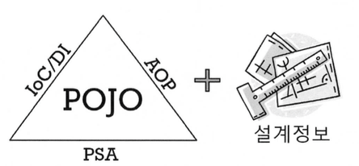

## 8.3 POJO 프로그래밍
- 스프링의 본질은 엔터프라이즈 서비스 기능을 `POJO`에게 제공하는 것을 말한다
- 엔터프라이즈 서비스라고 하는 것은 보안, 트랜잭션과 같은 엔터프라이즈 시스템에서 요구되는 기술을 말한다

### 스프링의 핵심:POJO
 
- 스프링 애플리케이션은 POJO를 이용해서 만든 애플리케이션 코드, POJO가 어떻게 관계를 맺고 동작하는지 정의해놓은 설계쩡보로 구분된다
- 스프링의 주요 기술인 IoC/DI, AOP, PSA는 애플리케이션을 POJO로 개발할 수 있게 해주는 가능기술이라고 불린다

### POJO(Plain Old Java Object)란 무엇인가?
- 객체지향적인 원리에 충실하면서 환경과 기술에 종속되지 않고 필요에 따라 재활용될 수 있는 바잇그올 설계된 오브젝트

### POJO의 조건
1. 특정 규약(contract)에 종속되지 않는다
    - POJO는 자바 언어와 꼭 필요한 API 외에는 종속되지 않아야 한다
    - 특정 규약에 따르는 경우는 특정 클래스를 상속하도록 요구한다(자바는 단일 상속이기 때문에 객체지향적으로 설계할 수 없음)
    - 규약이 적용된 환경에 종속적이기 때문에 다른 환경으로 이전이 힘듦
2. 특정 환경에 종속되지 않는다
    - 순수한 애플리케이션 로직을 담고 있는 오브젝트 코드가 특정 환경에 종속되게 만드는 경우라면 POJO라 할 수 없다
        - 비즈니스 로직에 웹 환경정보가 있는 경우(웹 환경에 국한되기 때문에 POJO라 볼 수 없ㅇ므)
    - 애노테이션
        - 환경에 종속되지 않는 경우 POJO라 할 수 있다

### POJO의 장점
- 특정한 기술과 환경에 종속되지 않은 오브젝트를 통해 코드가 깔끔해진다
- 자동화된 테스트에 유리하다
- 객체지향적인 설계를 자유롭게 적용할 수 있다

### POJO 프레임워크
- 스프링, 하이버네이트는 대표적인 POJO 프레임워크이다
- 스프링은 엔터프라이즈 애플리케이션 개발의 모든 영역과 계층에서 POJO 방식의 구현이 가능하게 하려는 목적으로 만들어졌다
- 스프링을 사용하면 POJO 프로그래밍의 장점을 그대로 살려서 엔터프라이즈 애플리케이션 개발을 할 수 있다
- 스프링은 비즈니스 로직의 복잡함과 엔터프라이즈 기술의 복잡함을 분리하여 구성할 수 있게 도와준다
- 스프링 프레임워크가 엔터프라이즈 기술에 대한 부분에 관여하고 비즈니스 로직을 담당하는 POJO에서는 직접 노출하지 않는다
- 스프링은 개발자가 복잡한 엔터프라이즈 기술보다는 객체지향적인 설계와 개발의 원리에 더 집중할 수 있게 도와준다
